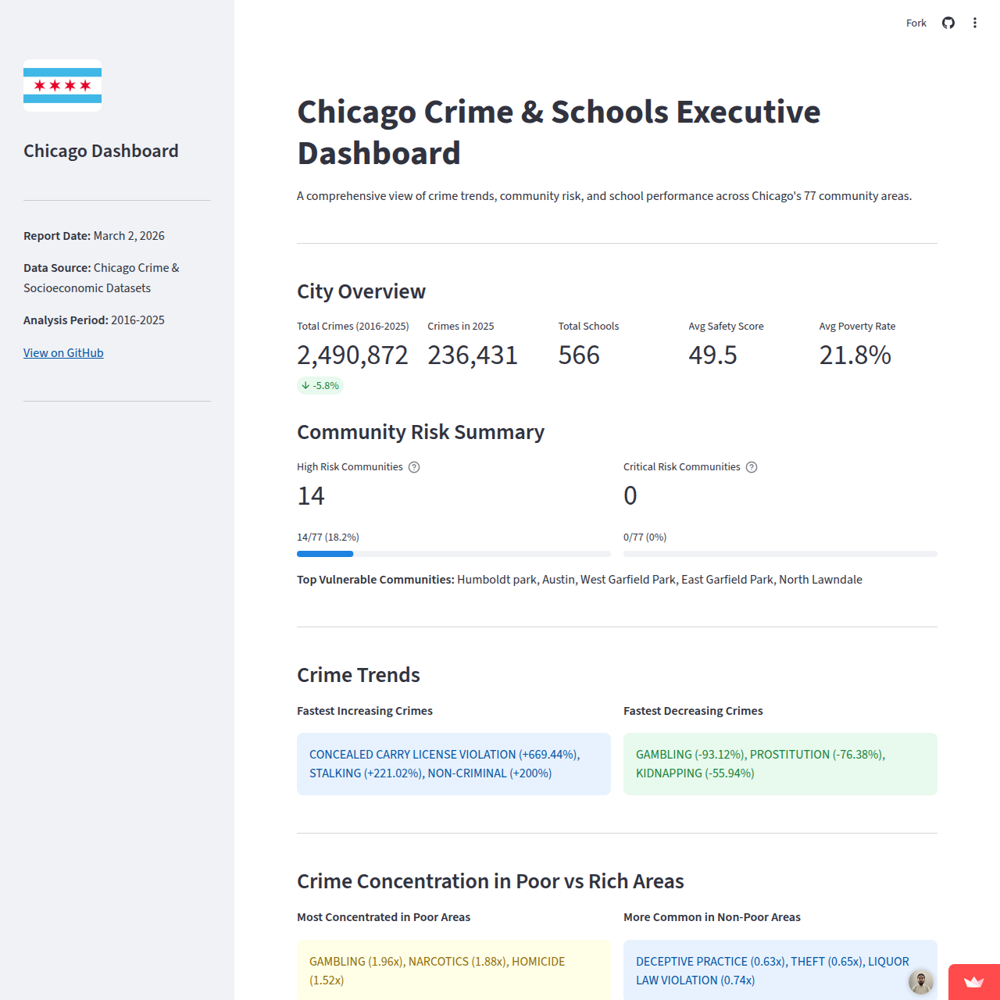

# Chicago Urban Crime & Socioeconomic Analysis

A multi-dataset SQL + Python analysis project exploring the relationship between socioeconomic conditions, school performance, and crime rates across Chicago's 77 community areas.

---

## Dashboard Preview

  
*Main dashboard view showing crime rates by community area and key socioeconomic indicators.*

---

## Explore the Live Dashboard

[](https://safouanehaddadi-chicago-crime-analysis-dashboard-deploy-lrbay6.streamlit.app)  
*Interact with the full dashboard to explore community-level crime trends, school performance metrics, and socioeconomic factors.*

---

##  Project Overview

This project integrates three public datasets from the City of Chicago's open data portal to answer a central question:

**Are crime rates in Chicago's neighborhoods driven by socioeconomic hardship and school performance — and if so, where should public resources be directed?**

The analysis is designed to serve decision-makers such as city planners, social services agencies, school boards, and law enforcement, providing a data-driven lens to prioritize interventions.

---

## Key Business Questions

| # | Question | Purpose |
|---|----------|---------|
| 1 | How have crime patterns evolved over time? Which crimes are increasing? | Trend Analysis |
| 2 | What socioeconomic factors most strongly correlate with crime rates? | Correlation Analysis |
| 3 | Can we categorize communities by risk profile for targeted interventions? | Segmentation |
| 4 | How do schools perform in high-crime vs low-crime areas? | Performance Analysis |
| 5 | Which crimes disproportionately affect vulnerable communities? | Equity Analysis |
| 6 | What key metrics should decision-makers track? | Executive Reporting |

---

##  Datasets Used

The project integrates three original City of Chicago public datasets:

| Dataset | Original Source File | Key Information |
|----------|----------------------|-----------------|
| Socioeconomic Indicators | ChicagoCensusData.csv | Income, poverty, unemployment, hardship index per neighborhood |
| Chicago Public Schools | ChicagoPublicSchools.csv | Safety scores, academic performance, school type |
| Chicago Crime Data | ChicagoCrimeData.csv | Crime type, location, date, arrest status (~2.5M rows) |

These raw datasets were cleaned and transformed into analytical views and exported summary datasets (`dashboard_data.csv`, `community_data.csv`) used for the final dashboard.


All three datasets share a common key: **`community_area`**, which allows cross-dataset analysis.

---

##  Step 1 — Data Cleaning

### Approach
All raw data was preserved in staging tables (`SchoolStaging`, `SocioStaging`, `ChicagoCrimes`) to ensure reproducibility. Cleaning was always performed on copies, never on originals. The crime table (~2.5M rows) was imported via `BULK INSERT` (Excel wizard fails on files this large).

### Schools Table
- Renamed all columns with spaces to `snake_case` for consistent querying  
- Dropped 50+ irrelevant columns (contact information, icon columns, granular grade-level metrics, internal codes, coordinate duplicates) — kept only analysis-relevant fields  
- Replaced `'NDA'` (No Data Available) strings with proper `NULL`, then converted affected columns to `FLOAT`  
- Expanded school type abbreviations (ES → Elementary school, HS → High school, MS → Middle school)  
- Imputed the single missing `avg_student_attendance` value using the dataset average  
- Confirmed no true duplicates — some schools share GPS coordinates due to co-located campuses, which is intentional and was preserved  


### Socioeconomic Table
- Renamed columns to **snake_case**
- Removed city-wide 'CHICAGO' summary row (not a neighborhood)
- Verified zero NULLs and valid percentage ranges (0-100)

### Crimes Table
- Dropped 10+ redundant or overly granular columns (`UpdatedOn`, `X/YCoordinate`, `Block`, `IUCR`, `FBICode`, `Beat`, `District`, `Ward`, `Location`, `Year`)  
- Renamed remaining columns to `snake_case` and standardized `crime_date` to `DATE` type  

- For `location_description`: trimmed whitespace, standardized to uppercase, merged ~40 location variants into clean categories, and set remaining `NULL` values to `'UNKNOWN'` — except for `DECEPTIVE PRACTICE` crimes (fraud, online scams), which have no physical location by nature and were labeled `'NO PHYSICAL LOCATION (ONLINE/PHONE)'`

- For `community_area` NULLs: imputed using nearest school via Manhattan distance on coordinates (`CROSS JOIN` approach) — 2 rows with no geographic data at all were deleted  

- For latitude/longitude NULLs: imputed using average school coordinates per community area as a centroid proxy  

- For duplicates: confirmed that multiple rows sharing the same `case_number` on different dates are legitimate (investigation updates, arrest follow-ups) — only deleted exact matches on the same `case_number` + same `crime_date`  

- Merged `'CRIM SEXUAL ASSAULT'` and `'CRIMINAL SEXUAL ASSAULT'` into a single consistent `crime_type` value  

### Final Output — Analytical Views
Created three views as foundation for analysis:
- `vw_Schools_Clean`
- `vw_SocioEconomic_Clean`
- `vw_Crimes_Clean`

All analysis queries reference these views, never raw tables.

---

##  Step 2 — Exploratory Data Analysis

Six analytical views were created to answer the business questions.

### Query 1: Crime Trends (2016-2025)
**View:** `vw_CrimeTrends`

**Key Insights:**
- Weapons-related crimes are rising fast (concealed carry +669%, weapons violations +58%)
- Car theft has become a much bigger problem (+53%)
- Violent crimes like homicide (-46%) and robbery (-51%) have decreased significantly

**What this means:** The city made progress on classic street crimes, but new issues (guns, stalking, car theft) need more focus.

---

### Query 2: Socioeconomic Factors vs Crime
**View:** `vw_Neighborhood_Crime_Socio_Rank`

**Key Insights:**
- Communities with highest crime rates are also the poorest (North Lawndale, Englewood, Austin)
- Some high-crime areas (Loop, Near North Side) have very low poverty (downtown areas)
- Some poor communities (Riverdale, Fuller Park) have low crime rates

**What this means:** Different neighborhoods need different solutions. Critical areas need everything (police + social services), downtown needs police, poor but safe areas need economic help.

---

### Query 3: Community Risk Categories
**View:** `vw_CommunityRisk`

**Key Insights:**
- **Group 1 (High crime, low poverty):** Austin, Loop, Near North Side — need police presence
- **Group 2 (High poverty, low crime):** Riverdale, Fuller Park — need jobs, social services
- **Group 3 (High crime + high poverty):** Englewood, West Englewood, North Lawndale — need everything

**What this means:** You can't treat all communities the same. Each group needs a different solution.

---

### Query 4: School Safety in High-Crime Areas
**View:** `vw_School_Safety_Comparison`

**Key Insights:**
- Schools in high-crime areas: safety score 45.8 vs 67.5 in low-crime areas
- Math scores: 17.9% vs 29.7% (almost half)
- Misconduct rates: 3x higher in high-crime areas
- Poverty in high-crime areas (28%) is double that of safe areas (14%)

**What this means:** Fixing schools needs more than police — social workers, counselors, food programs, and extra academic support are essential.

---

### Query 5: Crime Composition in Vulnerable Areas
**View:** `vw_CrimeConcentration`

**Key Insights:**
- **Poor neighborhoods:** Homicide (1.52x), narcotics (1.88x), gambling (1.96x) are highly concentrated
- **Rich neighborhoods:** Theft (0.65x) and deceptive practices (0.63x) are more common

**What this means:** Different crimes need different strategies. Poor areas need violence prevention; rich areas need theft prevention.

---

### Query 6: Executive Dashboard
**View:** `vw_ExecutiveDashboard`

The final dashboard brings all insights together into one interactive view.

---

##  Step 3 — Interactive Dashboard
An interactive dashboard was built using **Streamlit** and **Plotly**, visualizing all key findings in one place.

### Dashboard Features
- **KPIs**: Key metrics at a glance (total crimes, crime change, schools, safety, poverty)
- **Community Risk Summary**
- **Crime Trends**
- **Crime Concentration**
- **Scatter Plot**: Poverty vs crime correlation (77 communities)
- **School Gap Charts**: Safety and math score disparities


### Live Dashboard
[**Chicago Crime & Schools Dashboard**](https://safouanehaddadi-chicago-crime-analysis-dashboard-deploy-lrbay6.streamlit.app/)

---


##  Repository Structure

```
├── dashboard_data.csv
├── community_data.csv
├── dashboard_deploy.py
│
├── sql/
│   ├── Chicago_cleaning.sql
│   └── Chicago_EDA.sql
│
├── scripts/
│   ├── db_connection.py
│   └── dashboard.py
│
├── reports/
│   ├── SQL_Report.pdf
│   └── Dashboard_Report.pdf
│
├── requirements.txt
└── README.md
```

---

##  How to Run Locally

```bash
git clone https://github.com/SafouaneHaddadi/chicago-crime-analysis.git
cd chicago-crime-analysis

# (Optional but recommended) create virtual environment
python -m venv venv
source venv/Scripts/activate  # Windows Git Bash
# or: source venv/bin/activate  # Mac/Linux

pip install -r requirements.txt
streamlit run dashboard_deploy.py
```

---

##  Reports

- SQL Analysis Report
- Dashboard Report

---

## Contact

Feel free to reach out or connect with me:


-  Email: [safouane.haddadi@outlook.com](mailto:safouane.haddadi@outlook.com)  
-  LinkedIn: [linkedin.com/in/safouane-haddadi/](https://www.linkedin.com/in/safouane-haddadi/)

---

## Data Sources

- **Chicago Crime Data (2001–Present)** — [City of Chicago Open Data](https://data.cityofchicago.org/Public-Safety/Crimes-2001-to-Present/ijzp-q8t2/about_data)  
- **Chicago Socioeconomic Indicators** — [City of Chicago Open Data](https://data.cityofchicago.org/Health-Human-Services/Census-Data-Selected-socioeconomic-indicators-in-C/kn9c-c2s2/about_data)  
- **Chicago Public Schools Progress Report Cards** — [City of Chicago Open Data](https://data.cityofchicago.org/Education/Chicago-Public-Schools-Progress-Report-Cards-2011-/9xs2-f89t/about_data)

## Acknowledgment

This project was inspired by the:

**Coursera – IBM Data Analyst Professional Certificate**


The course that introduced me to the Chicago datasets and inspired this project. While the course covered basic analysis, I extended it with comprehensive data cleaning, advanced SQL queries, and a full interactive dashboard.

##  License

This project is for educational and portfolio purposes.  


